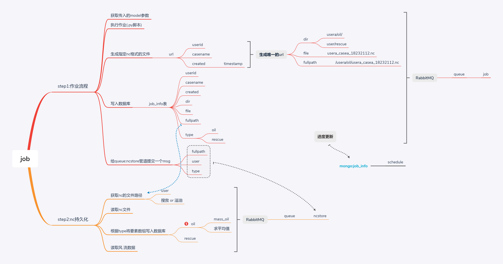

后台的目录结构如下
<pre><code>
├──./                            
├──01 byJupyter  
├──02 rescue                       <= 读取nc文件并写入mongo的proj
├──03 messagehandle                <= 使用rabbitmq实现的分布式消息队(原型) by zw
├──04 byRabbitmq                   <= 最终的消息队列的实现版
</code></pre>

---

[rabbitmq 安装可以参考](https://github.com/RandolphChin/RandolphChin.github.io/issues/203)

# 1 作业设计 job
## 1.1 job info  
job info主要为后端接收到前端提交的(eg:溢油的model信息以及其他信息),由`django`接收到请求后，直接通过`rabbitmq`的`生产者`提交给`消息队列`，延迟的操作交给后台的消费者来处理
  
job主要包括几个步骤：
+ 获取提交的溢油model的相关参数
+ 生成一个nc的url地址 
> eg:   userId:xxx123
        case:xxx_a
        created:一个timestap
        =>
        xxx123_xxx_a_timestap
  
+ 写入db

